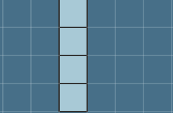
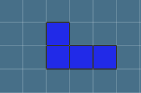
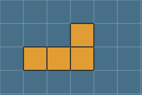
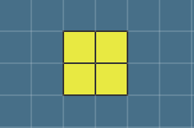
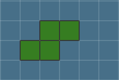
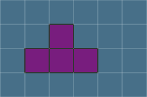
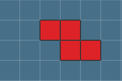

# Angular Tetris Implementation

## Contents

1. [Introduction](#introduction)
2. [Components](#components)
   1. [Main Game Component](#main-game-component)
   2. [Next Piece Component](#next-piece-component)
   3. [Hold Piece Component](#hold-piece-component)
3. [Models and Interfaces](#models-and-interfaces)
    1. [Tetris Input Interface](#tetris-input-interface)
    2. [Canvas Model](#canvas-model)
    3. [Abstract Tetris Piece Model](#abstract-tetris-piece-model)
    4. [Concrete Tetris Pieces Models](#concrete-tetris-pieces-models)
4. [Services](#services)
    1. [Game Service](#game-service)
    2. [Next Pieces Service](#next-pieces-service)
    3. [Observable Tetris Piece Service](#observable-tetris-piece-service)
    4. [Tetris Collision Service](#tetris-collision-service)
    5. [Tetris Piece Drawing Service](#tetris-piece-drawing-service)
    6. [Tetris Piece Object Service](#tetris-piece-object-service)
5. [Conclusion](#conclusion)

### Introduction

In this document we will go through the implementation of the Angular Tetris game. We will go through the different components and services that make up the game and how they interact with each other. We will do these folder by folder, explaining the folder content and how it is used in the game.
Some pieces of the code will be shown here, which can be found in the `src\app` [folder](../../app/) of the project.

### Components

The project contains 4 components, which are the following:

#### Main Game Component

- `main-game.component.ts` | [Open File](../../app/components/main-game/main-game.component.ts) - The main game component has the main canvas, which is the one in the middle. In this canvas the pieces that the player controls are drawn, as well as the grid and the next piece.
  To detect the keyboard events, the `HostListener` decorator is used, which allows to listen to events on the host element of the component, which in this case is the canvas. The `keydown` event is used to detect when the user presses a key, and the `keyup` event is used to prevent the user from holding down the key and moving the piece too fast. To know which method to be called based on the key pressed, a ``Record` is used, which is basically a `switch statement`. The `Record` is defined as follows:

```typescript
private inputLogic: Record<string, () => void> = {
    ['a']: this.movePieceLeft.bind(this),
    ['s']: this.movePieceDown.bind(this),
    ['d']: this.movePieceRight.bind(this),
    ['e']: this.rotatePiece.bind(this),
    ['w']: this.movePieceDownhardDrop.bind(this),
    ['f']: this.holdCurrentPiece.bind(this),
  };
```

This type of annotation is used all thorough the application, so how does it work?

```typescript
switch (key) {
  case "a":
    this.movePieceLeft();
    break;
  case "s":
    this.movePieceDown();
    break;
  case "d":
    this.movePieceRight();
    break;
  case "e":
    this.rotatePiece();
    break;
  case "w":
    this.movePieceDownhardDrop();
    break;
  case "f":
    this.holdCurrentPiece();
    break;
}
```

This is how basically the `Record` looks like as a `switch` statement, I used because it does not "clog" the code as much as a `switch` statement does, and it is easier to manipulate.
Since we are here, the methods presented here should be self-explanatory, by their names, but how do they make the piece move? Well there's a service for that, which we will see later on, but in general thats how all components work, they listen to events and call methods from services to do the work.

In this case the `main-game.component.ts` component is the more complex one, it could be a little more modularized, but it works as it is. Most of the complexity comes from the fact that the component uses almost all the services, and it is the one that has the most interaction with the user.

The services are called trough the `constructor` of the component, which is the following:

```typescript
public constructor(
  private _tetrisPieceDrawingService: TetrisPieceDrawingService,
  private _observableTetrisPieceService: ObservableTetrisPieceService,
  private _tetrisCollisionService: TetrisCollisionService,
  private _gameService: GameService
) {
    this.setObservableTetrisPieceService();
}
```

In this component at least 4 services are used, which I will enter in more detail later on, but for now, the `constructor` is the place where the services are injected into the component, and the `setObservableTetrisPieceService()` method is called, which is the following:

```typescript
private setObservableTetrisPieceService(): void {
  this._observableTetrisPieceService.currentTetrisPieceSubject.subscribe(
    (currentPiece: TetrisPiece | null) => {
      if (currentPiece === null || currentPiece === undefined) return;
        this._currentPiece = currentPiece;
        this.drawPiece();
      }
  );

  this._observableTetrisPieceService.startGameSubject.subscribe(
    (value: boolean) => {
      if (value) {
        this.startGameLoop();
        this._currentPiece?.clearCanvas();
        this._tetrisCollisionService.setTetrisBoard();
      }
    }
  );

  this._observableTetrisPieceService.linesClearedSubject.subscribe(
    (value: number[]) => this.clearLines(value)
  );
}
```

It basically prepares the `ObservableTetrisPieceService` to be used. Everytime we want to `observe` a property this annotation is used.

For the pieces movement the `TetrisCollisionService` and the `TetrisPieceDrawingService` are used, the first one is for detecting pieces collisions, the latter is to draw the pieces on the canvas. Let's see how the `movePieceRight()` method works:

```typescript
public movePieceRight(): void {
    if (this.checkCollision('right')) return;
    this._currentPiece!.movePieceRight(this._canvasContext!) || null;
}
```

```typescript
private checkCollision(direction: 'down' | 'left' | 'right'): boolean {
    return this._tetrisCollisionService.checkCollision(
      this._currentPiece?.xCoordinates!,
      this._currentPiece?.yCoordinates!,
      direction,
      this._currentPiece!
    );
}
```

As we can see, the component does do much, it simply calls for the services to do the work, and the services do the work. The `movePieceRight()` method calls the `checkCollision()` method, which is the one that checks if the piece can move to the right, if it can, then the `movePieceRight()` method from the `TetrisPiece` class is called, which is the one that actually moves the piece to the right.

In case the piece cannot move to the right, the `checkCollision()` method returns `true`, and the `movePieceRight()` method returns `null`, which means that the piece cannot move to the right, ignoring the user input.

The remaining methods work in a similar way, so I will not go into detail about them.

There's a few more methods in this component which are worth going into detail, which are the following:

```typescript
public ngAfterViewInit(): void {
    this._canvasContext = this.canvas.nativeElement.getContext('2d');
    this._canvas = new Canvas(
      this.canvas.nativeElement,
      undefined,
      undefined,
      -40
    );
    this._tetrisPieceDrawingService.tetrisPieceObjectService.canvas =
      this._canvas;

    this._tetrisCollisionService.gridScale = this._canvas.gridUnit;
    this._canvasGridUnit = this._canvas.gridUnit;
}
```

The `ngAfterViewInit()` method is called after the view is initialized, and it is used to initialize the canvas, and set the `gridScale` property of the `TetrisCollisionService`, which is used to calculate the collisions. The `-40` is an attempt to make piece spawn a bit higher, so that the user has more time to react. In the other components the `ngAfterViewInit()` method is also used to initialize the canvas and other properties, since we only want them to be initialized after the view is initialized.

The following method is to hold the current piece, which could be one of the methods to improve the modularity of the component, but it works as it is:

```typescript
public holdCurrentPiece(): void {
  if (!this._canHoldPiece || !this._currentPiece) return;

  const holdenPiece = this._observableTetrisPieceService.holdenTetrisPiece;
  this._observableTetrisPieceService.holdenTetrisPiece = this._currentPiece!;
  this._canHoldPiece = false;

  if (holdenPiece) {
    this._currentPiece.clearPiecePreviousPosition(this._canvasContext!);
    this._currentPiece = holdenPiece;
    this.drawPiece();
  } else {
    this.nextPiece(false);
  }
}
```

The `holdCurrentPiece()` method is called when the user presses the `f` key, and it holds the current piece, if possible, since the user can only hold the piece once per new piece. If the user holds the piece, the `holdenTetrisPiece` property of the `ObservableTetrisPieceService` is set to the current piece, and the `canHoldPiece` property of the component is set to `false`, so that the user cannot hold the piece again. If the user has already held a piece, then the current piece is set to the holden piece, and the holden piece is set to the current piece, and the `drawPiece()` method is called, which draws the piece on the canvas.

The `holdenTetrisPiece` is then used in the `hold-piece.component.ts` component.

For the game loop, the `startGameLoop()` and the `endGameLoop()` methods are used, which are the following:

```typescript
private startGameLoop(): void {
  if (this._gameLoopInterval !== undefined) return;

  this._gameLoopInterval = setInterval(() => {
    if (this._currentPiece) this.movePieceDown();

    if (!this.checkIfPieceMoved()) {
      if (this._currentPiece?.yCoordinates == 0) this.endGameLoop();
      this.nextPiece();
    }
  }, this._gameService.gameSpeed);
}
```

```typescript
private endGameLoop(): void {
    clearInterval(this._gameLoopInterval);
    this._gameLoopInterval = undefined;
    this._gameService.endGame();
}
```

Both methods should be easy to understand, the method to start the game loop uses a `setInterval()` to create the loop, and the method to end the game loop uses the `clearInterval()` method to stop the loop.

Inside the loop, the `movePieceDown()` method is called, which moves the piece down, and the `checkIfPieceMoved()` method is called, which checks if the piece has moved, and if it hasn't, then the `nextPiece()` method is called, which is the method that spawns the next piece. In case the piece hasn't moved and the `yCoordinates` property of the piece is `0`, then the `endGameLoop()` method is called, which ends the game loop. This is because if the piece hasn't moved and the `yCoordinates` property is `0`, then the piece is at the top of the canvas, and the game should end.

In the `endGameLoop()` method, the `endGame()` method of the `GameService` is called, which is the method that ends the game. The `_gameLoopInterval` property is set to `undefined` so that the game loop can be started again.

Finally, the last method to check is the `clearLines()` method, which is the following:

```typescript
private clearLines(lines: number[]): void {
  const numberOfLines = lines.length;
  for (let i = 0; i < numberOfLines; i++) {
    this._canvasContext?.clearRect(
      0,
      lines[i] * this._canvasGridUnit - 1,
      this._canvasContext.canvas.width,
      this._canvasGridUnit + 2
    );
  }

  this._canvasContext!.save();
  this._canvasContext!.translate(0, this._canvasGridUnit * numberOfLines);
  this._canvasContext!.drawImage(this._canvas?.canvas!, 0, 0);
  this._canvasContext!.restore();

  this._gameService.addScore(numberOfLines * numberOfLines);
}
```

It checks how many lines were cleared, and then it clears the lines, and adds the score to the game. The `clearRect()` method is used to clear the lines, and the `drawImage()` method is used to draw the canvas again, but translated by the number of lines that were cleared, so that the pieces that were above the cleared lines are moved down.

This method is called using one of the observables of the `ObservableTetrisPieceService`, which is the `linesCleared` observable.

The other two `components` are a lot more simple, either way let's go over them.

#### Hold Piece Component

- `hold-piece.component.ts` | [Open File](../../app/components/hold-piece/hold-piece.component.ts) - The `HoldPieceComponent` is the component that holds the piece that the user has held, and it is used to display the piece that the user has held, on the left canvas. It has the same concepts has the previous component, but it is a lot more simple. It initializes the services on the constructor, subscribes to the `holdenTetrisPiece` property of the `ObservableTetrisPieceService` to check when a new piece was holdenm and uses the `ngAfterViewInit()` method to initialize the canvas.

This component only has two methods, besides of the `ngAfterViewInit()` method, which are the following:

```typescript
private holdPiece(pieceToHold: TetrisPiece): void {
  const holdenPiece = this._currentHoldPiece;
  this._currentHoldPiece = pieceToHold;

  this.postionPiece();
  this._canvasContext = this._tetrisPieceDrawingService.getPieceDrawing(
    this._canvasContext!,
    this._currentHoldPiece!
  );

  if (holdenPiece)
    this._observableTetrisPieceService.currentTetrisPiece = holdenPiece;
}
```

```typescript
private postionPiece(): void {
  this._canvasContext!.clearRect(0, 0, 2000, 2000);
  this._currentHoldPiece!.movePiece(this._canvasContext!, 0, 0);
  const setPieceCenterFunction =
    this._currentHoldPiece!.constructor.name === 'TPiece' ||
    this._currentHoldPiece!.constructor.name === 'SPiece'
      ? () => {
          this._currentHoldPiece!.movePieceLeft(this._canvasContext!);
        }
      : () => {
          this._currentHoldPiece!.movePieceRight(this._canvasContext!);
        };
  for (let i = 0; i < 2; i++) setPieceCenterFunction();
  this._currentHoldPiece!.movePieceDown(this._canvasContext!);
  this._currentHoldPiece!.movePieceDown(this._canvasContext!);
}
```

The `holdPiece()` method is called when the `holdenTetrisPiece` property of the `ObservableTetrisPieceService` is changed, and it holds the piece that was passed as a parameter, and sets the `currentHoldPiece` property of the component to the piece that was passed as a parameter. It then positions the piece using the `postionPiece()` method, and then it draws the piece on the canvas using the `getPieceDrawing()` method of the `TetrisPieceDrawingService`.

The last method is used because of the scale of the canvas and the pieces, the `2000` number used in the `clearRect()` method is used to clear the canvas fully, almost any number above the canvas size would work, but `2000` is used because it is a big number, and it is easy to remember.

#### Next Pieces Component

- `next-pieces.component.ts` | [Open File](../../app/components/next-pieces/next-pieces.component.ts) - This component is even simpler than the previous one, it is used to display the next pieces that will spawn, since it wasn't possible to have an working canvas with it so instead some images were used. This way this component has no methods, having only two properties and the contructor.

```typescript
public constructor(
  _observableTetrisPieceService: ObservableTetrisPieceService,
  _nextPiecesService: NextPiecesService
) {
  _nextPiecesService.setFirstNextPieces();
  _observableTetrisPieceService.startGameSubject.subscribe(
    (value: boolean) => {
      if (value) {
        this.nextPiecesImageSourceArray =
          _nextPiecesService.nextPiecesImageSourceArray;
      }
    }
  );
  _observableTetrisPieceService.currentTetrisPieceSubject.subscribe
    (value) => {
      if (this._firstPiece) {
        this._firstPiece = false;
        return;
      }
      if (value === null) {
        _nextPiecesService.setNextPiece();
        this.nextPiecesImageSourceArray =
          _nextPiecesService.nextPiecesImageSourceArray;
      }
    }
  );
}
```

The constructor initializes the services, and subscribes to the `startGameSubject` and `currentTetrisPieceSubject` observables of the `ObservableTetrisPieceService`. The `startGameSubject` observable is used to check when the game starts, and then it sets the `nextPiecesImageSourceArray` property of the component to the `nextPiecesImageSourceArray` property of the `NextPiecesService`. The `currentTetrisPieceSubject` observable is used to check when the current piece is set to `null`, which means that either the piece was placed on the board or it was the first swap, and then it sets the next piece using the `setNextPiece()` method of the `NextPiecesService`, and then it sets the `nextPiecesImageSourceArray` property of the component to the `nextPiecesImageSourceArray` property of the `NextPiecesService`.

The `nextImagesSourceArray` property is used to display the next pieces, and it is used in the `next-pieces.component.html` file, which is the following:

```html
<div class="images-section">
  <ul>
    <li *ngFor="let piece of nextPiecesImageSourceArray">
      
    </li>
  </ul>
  <div></div>
</div>
```

So the component is a list of images, sets the next piece and nothing more.

### Models and Interfaces

In this application there's essentially two models and one interface. The models are the `TetrisPiece` and `Canvas`, and the interface is the `TetrisInput` interface.

We will start with the interface since it is the simplest one.

#### Tetris Input Interface

- `tetris-input.ts` | [Open File](../../app/interfaces/tetris-input.ts) - This interface is used to define the input that the user can use to play the game, and it is used in the `TetrisPiece` model, which is the following:

```typescript
export interface TetrisInput {
  movement: number;
  rotatePieceClockwise(context: CanvasRenderingContext2D): CanvasRenderingContext2D;
  movePieceDown(context: CanvasRenderingContext2D, hardDrop: boolean): CanvasRenderingContext2D;
  movePieceLeft(context: CanvasRenderingContext2D): CanvasRenderingContext2D;
  movePieceRight(context: CanvasRenderingContext2D): CanvasRenderingContext2D;
}
```

It's essentialy the base moves that the Tetris games allows the user to do on a tetris piece. The reason why there's a `CanvasRenderingContext2D` parameter on each method is because the context of the canvas is tricky to get, and it is easier to get it on the `TetrisPiece` model and then pass it as a parameter to the methods and received a new one. The `movement` property is used to check how much the piece moves, by default it should move one unit, which is the size of a block or a grid unit from the `Canvas`.

#### Canvas Model

- `canvas.ts` | [Open File](../../app/models/canvas.ts) - The canvas model is used mostly to prevent data clump, so a class was extracted. In this class, besides of the `getters` and `setters` for the properties, there's only one method, which is the `drawCanvasGrid()` method, which is the following:

```typescript
private drawCanvasGrid(): Node {
  const step = this.gridUnit;

  var canvasGridElement = document.createElement('canvas');
  canvasGridElement.width = this.width;
  canvasGridElement.height = this.height;

  var canvasGrid = canvasGridElement.getContext('2d')!;
  canvasGrid.beginPath();
  for (var x = 0; x <= this.width; x += step) {
    canvasGrid.moveTo(x, 0);
    canvasGrid.lineTo(x, this.height);
  }

  canvasGrid.strokeStyle = 'rgba(300,300,300, 0.15)';
  canvasGrid.lineWidth = 2;
  canvasGrid.stroke();
  canvasGrid.beginPath();

  for (var y = 0; y <= this.height; y += step) {
    canvasGrid.moveTo(0, y);
    canvasGrid.lineTo(this.width, y);
  }

  canvasGrid.strokeStyle = 'rgba(300,300,300, 0.15)';
  canvasGrid.lineWidth = 2;
  canvasGrid.stroke();
  return canvasGridElement;
}
```

It essentially creates a canvas element, and then it draws the grid on it, adding this new element to the html parent element of the canvas. To manipulate the grid, this is the method to change, the `strokeStyle` and `lineWidth` properties can be changed to change the color and the width of the grid lines.

#### Abstract Tetris Piece Model

- `tetris-piece.ts` | [Open Folder](../../app/models/pieces/) - The tetris piece model is an absctraction of the tetris pieces, it is used to create the pieces, and it is used to move them. This is the part of the code which gets complicated to maintain, since it is a lot of code, mainly because the drawing and other functionalities require a lot of small methods. The concrete implementation of the tetris pieces are in the `tetris-pieces` folder, and the abstract class is in the `tetris-piece.ts` file.

This model implements the `TetrisInput` interface and uses an enumerator to define the rotation of the pieces, starting at 0 and ending at 270.

This class could be divided into two classes, one for the piece movement and one for the piece drawing, but since there would be a lot of code duplication, it was decided to keep it as one class.

The methods to draw the pieces are the following:

- `drawPiece()` - This method is used to draw the piece on the canvas, given a context and the dimensions of the piece. This method is `abstract`, so it is implemented on the concrete classes.
- `drawPieceAndBorder()` - This method is used to draw the piece and the border of the piece, given a context and the dimensions of the piece. The border that is, by default drawn, is the outer border, but a inner border can be drawn by passing extra arguments to the method. This method is `protected`, so all the concrete classes can use it.
- `clearPieceAndBorder()` - As it says, this method is used to clear the piece and the border of the piece, given a context and the dimensions of the piece. This method is `protected`, so all the concrete classes can use it. Some pieces `override` this method given their complexity.
- `clearCanvas()` - Clears the canvas of where the piece is. This method is `public`, so it can be used outside of the class.
- `clearPiecePreviousPosition()` - Clears the previous position of the piece. This method is `public`, so it can be used outside of the class. It's also `abstract`, so it is implemented on the concrete classes.

The methods to move the pieces are more simple, since based on the movement to be done, the only change is where the piece is going to be drawn. So besides of the methods to move the piece, there's also a method to check if the piece can be moved and one to check the piece position after being rotated. The methods to move the pieces are the following:

- `movePiece()` - This is the method that's called to move the piece, it receives a context, the coordinates to where the piece should be moved, and two booleans, one to check if the piece previous position should be cleared, and another to check if the piece should be drawn in the new position. This method is `public`, so it can be used outside of the class. All the methods that move the piece, `movePieceDown()`, `movePieceRight()` and `movePieceLeft()`, call this method.
- `canMoveToCoordinates()` - This method is used to check if the piece can be moved to the new position, it receives the coordinates to where the piece should be moved. This method is `public`, so it can be used outside of the class. In case the piece can't be moved, iit sets the piece 
to the maximum position it can be moved to.
- `rotatePiece()` - This method is used by the method from the `tetris-input` interface to rotate the piece clockwise. It's in a separe method in case counter-clockwise rotation is implemented in the future. This method is `protected` and `abstract`, so it is implemented on the concrete classes.
- `setRotationNewCoordinates()` - This method is used to check the piece position after being rotated, it receives the coordinates to where the piece should be moved after being rotated, it works similarly to the `canMoveToCoordinates()` method. This method is `public`, so it can be used outside of the class. In case the piece can't be moved, it sets the piece to the maximum position it can be moved to.

Besides of this methods there are also the ``getters`` and ``setters`` for the properties of the class. Overall it seems simple at first but given the complexity of some pieces can be hard to maintain.

#### Concrete Tetris Pieces Models

- `concrete-pieces` | [Open Folder](../../app/models/pieces/concrete-pieces/) - The concrete tetris pieces models are the concrete implementation of the tetris pieces, they are used to create the pieces, and they are used to move them. This is the part of the code which gets complicated to maintain, since it is a lot of code, mainly because the drawing and other functionalities require a lot of small methods. The abstract class is in the `tetris-piece.ts` file.

First of all, let's see how each piece looks like and their names:

- `I Piece`



- `J Piece`



- `L Piece` 



- `O Piece` 



- `S Piece` 



- `T Piece` 



- `Z Piece` 



The pieces are all very similar, they all have the same methods, but they have different implementations of the methods. We'll go through an overall of how the pieces are implemented, and then we'll go through some of them in more detail. We will not cover the `OPiece` since it is the simplest piece, instead we will go through the `IPiece` and the `TPiece`.


### Services
#### Game Service

#### Next Pieces Service

#### Observable Tetris Piece Service

#### Tetris Collision Service

#### Tetris Piece Drawing Service

#### Tetris Piece Object Service

### Conclusion
